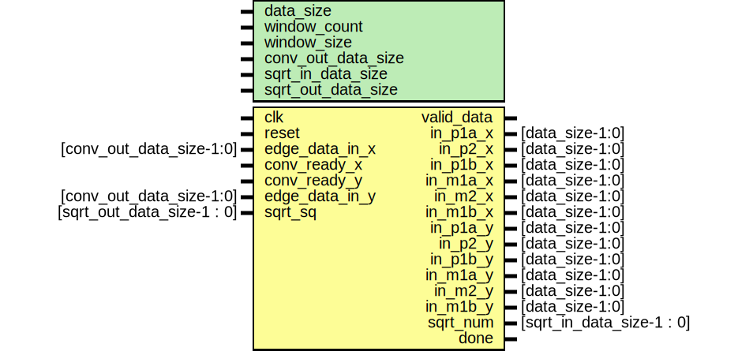
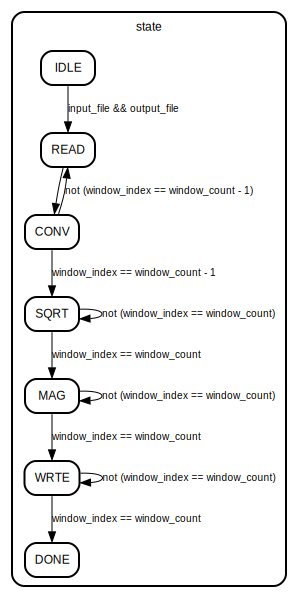

# Entity: controller 
- **File**: controller.v

## Diagram

## Generics

| Generic name       | Type | Value | Description                                  |
| ------------------ | ---- | ----- | -------------------------------------------- |
| data_size          |      | 24    | Global 24-bit data size                      |
| window_count       |      | 9     | Number of tracing/sliding windows            |
| window_size        |      | 9     | Size of the sliding window                   |
| conv_out_data_size |      | 29    | Output data size from the convolution module |
| sqrt_in_data_size  |      | 60    | Input data size for the sqrt module          |
| sqrt_out_data_size |      | 30    | Output data size for the sqrt module         |

## Ports

| Port name      | Direction | Type                       | Description                                    |
| -------------- | --------- | -------------------------- | ---------------------------------------------- |
| clk            | input     |                            | Clock signal                                   |
| reset          | input     |                            | Reset signal                                   |
| valid_data     | output    |                            | Data valid signal                              |
| in_p1a_x       | output    | [data_size-1:0]            | Input signals for the X convolution module     |
| in_p2_x        | output    | [data_size-1:0]            | Input signals for the X convolution module     |
| in_p1b_x       | output    | [data_size-1:0]            | Input signals for the X convolution module     |
| in_m1a_x       | output    | [data_size-1:0]            | Input signals for the X convolution module     |
| in_m2_x        | output    | [data_size-1:0]            | Input signals for the X convolution module     |
| in_m1b_x       | output    | [data_size-1:0]            | Input signals for the X convolution module     |
| in_p1a_y       | output    | [data_size-1:0]            | Input signals for the Y convolution module     |
| in_p2_y        | output    | [data_size-1:0]            | Input signals for the Y convolution module     |
| in_p1b_y       | output    | [data_size-1:0]            | Input signals for the Y convolution module     |
| in_m1a_y       | output    | [data_size-1:0]            | Input signals for the Y convolution module     |
| in_m2_y        | output    | [data_size-1:0]            | Input signals for the Y convolution module     |
| in_m1b_y       | output    | [data_size-1:0]            | Input signals for Y the convolution module     |
| edge_data_in_x | input     | [conv_out_data_size-1:0]   | Output signals from the X convolution module   |
| conv_ready_x   | input     |                            | Ready signal from the X convolution module     |
| conv_ready_y   | input     |                            | Ready signal from the Y convolution module     |
| edge_data_in_y | input     | [conv_out_data_size-1:0]   | Output signals from the Y convolution module   |
| sqrt_num       | output    | [sqrt_in_data_size-1 : 0]  | Input signals for the sqrt module              |
| sqrt_sq        | input     | [sqrt_out_data_size-1 : 0] | Output signals from the sqrt module            |
| done           | output    |                            | Done signal to indicate the end of the process |

## Signals

| Name                      | Type                                         | Description                                                   |
| ------------------------- | -------------------------------------------- | ------------------------------------------------------------- |
| state                     | reg [3:0]                                    | FSM variable                                                  |
| input_file                | integer                                      | File handles                                                  |
| output_file               | integer                                      | File handles                                                  |
| buffer[0:window_size - 1] | reg [data_size-1:0]                          | 3x3 sliding window buffer                                     |
| window_index = 0          | integer                                      | window index to trace the currently processed window          |
| delayed_window_index = 0  | integer                                      | delayed window index to trace the previously processed window |
| i_window = 0              | integer                                      | window index to load the memory with the binary input data    |
| Ix[0:window_count - 1]    | reg [conv_out_data_size-1:0]                 | Ix array                                                      |
| Iy[0:window_count - 1]    | reg [conv_out_data_size-1:0]                 | Iy array                                                      |
| sq[0:window_count - 1]    | reg [sqrt_out_data_size-1:0]                 | Square root array                                             |
| sum                       | reg [sqrt_out_data_size+window_count -1 : 0] | Sum of the square root values                                 |
| Threshold = 0             | integer                                      | Threshold value for the magnitude calculation                 |
| thrs[0:window_count - 1]  | reg [data_size-1:0]                          | Threshold array for the magnitude calculation                 |

## Constants

| Name | Type | Value | Description |
| ---- | ---- | ----- | ----------- |
| IDLE |      | 0     | FSM state   |
| READ |      | 1     | FSM state   |
| CONV |      | 2     | FSM state   |
| SQRT |      | 3     | FSM state   |
| MAG  |      | 4     | FSM state   |
| WRTE |      | 5     | FSM state   |
| DONE |      | 6     | FSM state   |

## Functions
- abs (input [conv_out_data_size-1:0] x; ) return ([conv_out_data_size-1:0])
- rounded_division (input [sqrt_out_data_size+window_count-1:0] numerator; ) return (integer)

## Processes
- fsm_function: ( @(posedge clk or posedge reset) )
  - **Type:** always

## State machines

- Threshold array for the magnitude calculation