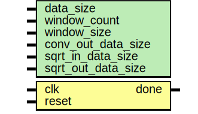

# Entity: sobel_top 
- **File**: sobel_top.v

## Diagram

## Generics

| Generic name       | Type | Value                 | Description                                                                                                                     |
| ------------------ | ---- | --------------------- | ------------------------------------------------------------------------------------------------------------------------------- |
| data_size          |      | 24                    | Pixel data size (RGB)                                                                                                           |
| window_count       |      | 9                     | chnages based on photo size                                                                                                     |
| window_size        |      | 9                     | 3x3 window size for convolution (Fixed)                                                                                         |
| conv_out_data_size |      | 29                    | Convolution output data size (Fixed)                                                                                            |
| sqrt_in_data_size  |      | 60                    | The sum of squares of two 29-bit numbers requires 60 bits to represent the result: (value1^2 + value2^2)                        |
| sqrt_out_data_size |      | sqrt_in_data_size / 2 | The square root of the sum of squares of two 29-bit numbers requires 30 bits to represent the result: sqrt(value1^2 + value2^2) |

## Ports

| Port name | Direction | Type | Description                                    |
| --------- | --------- | ---- | ---------------------------------------------- |
| clk       | input     |      | Clock signal                                   |
| reset     | input     |      | Reset signal                                   |
| done      | output    |      | Done signal to indicate the end of the process |

## Signals

| Name           | Type                            | Description                                  |
| -------------- | ------------------------------- | -------------------------------------------- |
| in_p1a_x_w     | wire [data_size-1:0]            | Input signals for the X convolution module   |
| in_p2_x_w      | wire [data_size-1:0]            | Input signals for the X convolution module   |
| in_p1b_x_w     | wire [data_size-1:0]            | Input signals for the X convolution module   |
| in_m1a_x_w     | wire [data_size-1:0]            | Input signals for the X convolution module   |
| in_m2_x_w      | wire [data_size-1:0]            | Input signals for the X convolution module   |
| in_m1b_x_w     | wire [data_size-1:0]            | Input signals for the X convolution module   |
| in_p1a_y_w     | wire [data_size-1:0]            | Input signals for the Y convolution module   |
| in_p2_y_w      | wire [data_size-1:0]            | Input signals for the Y convolution module   |
| in_p1b_y_w     | wire [data_size-1:0]            | Input signals for the Y convolution module   |
| in_m1a_y_w     | wire [data_size-1:0]            | Input signals for the Y convolution module   |
| in_m2_y_w      | wire [data_size-1:0]            | Input signals for the Y convolution module   |
| in_m1b_y_w     | wire [data_size-1:0]            | Input signals for the Y convolution module   |
| data_out_x_w   | wire [conv_out_data_size-1:0]   | Output signals from the X convolution module |
| data_out_y_w   | wire [conv_out_data_size-1:0]   | Output signals from the Y convolution module |
| valid_data_w   | wire                            | Data valid signal                            |
| conv_ready_x_w | wire                            | Ready signal from the X convolution module   |
| conv_ready_y_w | wire                            | Ready signal from the Y convolution module   |
| sqrt_num_w     | wire [sqrt_in_data_size-1 : 0]  | input signals for the sqrt module            |
| sqrt_sq_w      | wire [sqrt_out_data_size-1 : 0] | output signals from the sqrt module          |

## Instantiations

- controller_inst: controller
- sobel_inst_x: sobel_matrix_conv
- sobel_inst_y: sobel_matrix_conv
- sqrt_inst: sqrt
